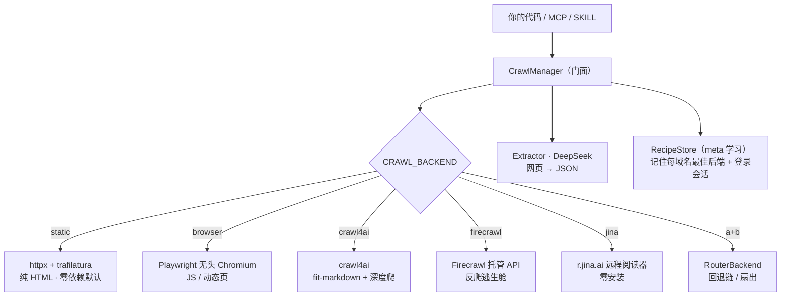

# agentcurl · 可切换后端的网页爬取中间件

[](https://github.com/chenhaodev/agentcurl/actions/workflows/ci.yml)

> 一套接口（`fetch` / `crawl` / `extract`）封装五种爬虫引擎，**一个环境变量切换**，
> 上层叠加 **DeepSeek 结构化抽取**（网页 → JSON）。可从**代码库 / MCP 服务 / Claude Code SKILL**
> 三种入口驱动 —— 三者都是同一个 `CrawlManager` 的薄封装。

`5 种后端` · `零依赖默认引擎` · `1 个变量切换` · `网页 → JSON` · `3 种入口` · `纯 CPU` · `实测可爬全球 Top10 的 9 个`


> 上面这段演示由 [`demo.tape`](demo.tape) 用 [vhs](https://github.com/charmbracelet/vhs) 录制（`vhs demo.tape`）。

[agentmem](https://github.com/chenhaodev/agentmem) 的姊妹项目，沿用同一形态：*一套通用接口、多个可插拔后端、环境变量切换*。

---

## 一分钟看懂（无需爬虫背景）

**遇到的问题**：爬一个网站从来不是「一种活」。有的页面是纯 HTML（解析飞快）；有的靠 JavaScript
渲染内容（得开真浏览器）；有的会反爬封你（得用托管代理服务）；而且拿到页面后你通常想要的是
**结构化数据**，不是一大坨文字。大家最后都在反复拼装 trafilatura + Playwright + 某个 API + 一次
大模型调用，每个站点都重写一遍胶水代码。

**这个项目怎么做**：把这些引擎统统藏到**一套接口**后面 —— `fetch`（取一页）/ `crawl`（爬整站）/
`extract`（抽 JSON）—— 用一个环境变量选引擎：

```
CRAWL_BACKEND=static → browser → crawl4ai → firecrawl → jina
```

默认引擎零额外安装；重型引擎按需开启。`extract` 再用 DeepSeek 把任意页面变成 JSON ——
**没配密钥时自动降级返回原始 markdown，离线也绝不崩**。

> **一句话**：别再为每个站点重写「取页 → 渲染 → 抽取」的胶水代码了 ——
> 把一个 `CrawlManager` 指向 URL，用环境变量切引擎即可。

---

## 核心概念（先读这 4 个词）

后面反复用到，先用大白话讲清楚（完整版见文末[名词速查](#附录名词速查)）：

- **后端 / backend**：实际干活的爬虫引擎。本项目有 5 个，能力不同（纯 HTML、真浏览器、托管 API……），
  但**对外长一个样**，靠一个环境变量切换。
- **结构化抽取 / extract**：把网页正文交给大模型，按你给的「字段表」或「一句话要求」吐回 **JSON**
  （比如 `{标题, 价格, 作者}`），而不是让你自己写正则去抠。
- **路由 / 回退链 / router**：把 `CRAWL_BACKEND` 写成 `static+jina` 这样的「加号串」，就会先试便宜的
  `static`，**取不到内容再自动落到** `jina`。一行配置搞定「先省钱、不行再上重的」。
- **meta 学习 / 配方**：仓库会**记住每个域名**怎么爬最顺（哪个后端有效、登录会话），**下次自动复用**——
  看你登录一遍，以后这个站点就自动带着登录态爬。详见[下面](#meta-学习看一遍下次就会)。

---

## 看它怎么爬

> 想一次看完下面所有案例？跑 `./demo.sh`（README 这一节的可复现版）。
> 想录成 GIF/视频分享：`asciinema rec demo.cast -c ./demo.sh` 或用 `vhs`。

### 案例 ① 一行命令，网页直接变 JSON

```bash
$ python -m agentcurl https://en.wikipedia.org/wiki/Web_scraping \
    --schema '{"title":"str","first_sentence":"str","key_topics":"list"}' --json
```
```json
{
  "url": "https://en.wikipedia.org/wiki/Web_scraping",
  "data": {
    "title": "Web scraping",
    "first_sentence": "Web scraping, web harvesting, or web data extraction is data scraping used for extracting data from websites.",
    "key_topics": ["web harvesting", "data scraping", "web crawling", "techniques", "legal issues"]
  },
  "raw": false
}
```

### 案例 ② 爬 YouTube 视频页 → 抽出结构化信息（真实输出）

YouTube 是纯 JS 渲染，`static` 只能拿到 146 字的空壳；换 `jina` 远程阅读器拿到 55KB 正文，
DeepSeek 再抽成 JSON：

```bash
$ CRAWL_BACKEND=jina python -m agentcurl "https://www.youtube.com/watch?v=dQw4w9WgXcQ" \
    --schema '{"video_title":"str","channel":"str","duration":"str","views":"str"}' --json
```
```json
{
  "data": {
    "video_title": "Rick Astley - Never Gonna Give You Up (Official Video) (4K Remaster)",
    "channel": "Rick Astley",
    "duration": "3:33",
    "views": "1,783,100,870"
  },
  "raw": false
}
```

### 案例 ③ 中文站点 + 回退链

`static` 先试，空了自动落到 `jina`；中文 GBK 站点（如寻医问药网）也能正确解码、不再乱码：

```bash
$ CRAWL_BACKEND=static+jina ROUTER_MODE=fallback python -m agentcurl https://www.xywy.com/
# 标题: 寻医问药网_值得信赖的互联网医疗健康服务平台
# 命中后端会标记在 metadata["router_backend"]
```

---

## 它到底能不能爬 Top 网站

不空口说。下表是**真实跑出来的**结果（2026-06，本机网络）：用 `static` 和 `jina` 各抓一次
全球访问量 Top10 站点的首页，记录 HTTP 状态码与拿到的 markdown 字符数。

| 站点 | `static`（状态/字符） | `jina`（状态/字符） | 推荐后端 |
|------|---------------------:|-------------------:|:--------|
| wikipedia.org | 200 / 11,891 | 200 / 61,343 | **static** ✅ |
| facebook.com | 200 / 387 | 200 / 7,415 | static / jina ✅ |
| google.com | 200 / 62 | 200 / 6,217 | **jina** ✅ |
| youtube.com¹ | 200 / 146 | 200 / 669 | **jina** ✅ |
| amazon.com | 200 / 142 | 200 / 182,216 | **jina** ✅ |
| baidu.com | 200 / 81 | 200 / 12,832 | **jina** ✅ |
| bing.com | 200 / 4 | 200 / 26,978 | **jina** ✅ |
| instagram.com | 200 / 0 | 200 / 2,282 | **jina** ✅ |
| reddit.com | **403（封）** | 200 / 82,259 | **jina** ✅ |
| x.com | 200 / 295（空壳） | 451（法律拦截） | 需登录 → meta ⚠️ |

**结论：Top10 里 9 个能直接爬下来**（`static` 或 `jina`）。`reddit` 对 `static` 直接 403 反爬，
但 `jina` 拿到 82KB —— 这正是「**回退链**」的价值：`static+jina` 一行配置自动兜住。唯一的硬骨头
`x.com` 需要登录态，而这正是下面 [meta 学习](#meta-学习看一遍下次就会) 的登录捕获功能要解决的。

> ¹ YouTube **首页**对所有人都稀疏（登录墙/启动页）；**视频页**内容很丰富 —— 见上面案例 ②，
> `jina` 拿到 55KB 并成功抽出标题/频道/时长/播放量。
>
> 复现：`RUN_LIVE=1 python tests/test_live.py`，或 `python benchmark.py --extract static jina`。

---

## 为什么选这些工具（不是拍脑袋）

每个后端都选用了**各自领域里最受认可的开源/托管方案**。下表 star 数为 `gh api` 实时拉取（2026-06）：

| 后端 | 底层项目 | GitHub | Star ⭐ | 为什么是它 |
|------|---------|--------|-------:|-----------|
| `static` | [adbar/trafilatura](https://github.com/adbar/trafilatura) | Python | **6.1k** | 学术界公认最准的正文抽取器之一（多次 ScrapingHub/CommonCrawl 评测领先），纯 CPU、毫秒级 |
| `browser` | [microsoft/playwright](https://github.com/microsoft/playwright) | TS | **91k** | 微软出品、事实标准的浏览器自动化，渲染 JS 页面 |
| `crawl4ai` | [unclecode/crawl4ai](https://github.com/unclecode/crawl4ai) | Python | **68.5k** | GitHub trending 常客、最火的「LLM 友好」开源爬虫，fit-markdown + 原生深度爬 |
| `firecrawl` | [firecrawl/firecrawl](https://github.com/firecrawl/firecrawl) | TS | **133k** | 当前最热的托管爬取服务，自带反爬/代理/渲染，是「被封了」时的逃生舱 |
| `jina` | [jina-ai/reader](https://github.com/jina-ai/reader) | TS | **11.2k** | 零安装远程阅读器（`r.jina.ai`），远端处理 JS，无需本地装任何东西 |

合计 **30 万+ star**，且全部在最近一个月内有提交（活跃维护）。换句话说：agentcurl 不发明新轮子，
而是把这五个**被社区投票选出来的**引擎统一到一套接口下，让你按场景一键切换。

---

## 架构



> 不支持 mermaid 的查看器可读作：
> `CrawlManager` 按 `CRAWL_BACKEND` 选一个后端（或把 `a+b` 包成回退链 router），
> 取回统一的 `Document`；`Extractor` 用 DeepSeek 把它变 JSON；`RecipeStore` 记住每个域名怎么爬最顺。

**契约**：所有后端都实现同一个 `CrawlBackend` 协议 —— `fetch(url) -> Document` 与
`crawl(url) -> [Document]`，`Document` 是最小公共结构
（`url, status, markdown, html, title, links, metadata`）。后端的「超能力」（Firecrawl 截图、
crawl4ai 的 fit-markdown 评分）放进 `metadata`，不污染契约 —— 所以换引擎是改配置，不是改代码。

---

## 快速开始

```bash
# ① 安装（默认 static 后端零额外依赖）
pip install -e .                       # 核心: httpx, trafilatura, openai, dotenv
# pip install -e ".[browser]"          # + Playwright（再跑 playwright install chromium）
# pip install -e ".[crawl4ai]"         # + crawl4ai（再跑 crawl4ai-setup）

# ② 配置（抽取需要 DeepSeek 密钥）
cp .env.example .env                   # 填入 DEEPSEEK_API_KEY

# ③ 用起来
python demo.py                                   # 取页 + 抽取，离线也能跑
python -m agentcurl https://example.com          # 打印干净 markdown
python -m agentcurl https://example.com --extract "标题和一句话摘要"
python -m agentcurl https://example.com --schema '{"title":"str"}' --json
python -m agentcurl https://example.com --crawl --depth 1 --max-pages 5
```

### 切换后端

```bash
CRAWL_BACKEND=static   python demo.py   # 默认，零额外安装
CRAWL_BACKEND=jina     python demo.py   # 远程阅读器，零安装（JS 远端处理）
CRAWL_BACKEND=browser  python demo.py   # Playwright 渲染 JS（需 playwright install chromium）
CRAWL_BACKEND=crawl4ai python demo.py   # fit-markdown + 深度爬（需 crawl4ai-setup）
CRAWL_BACKEND=static+firecrawl ROUTER_MODE=fallback python demo.py   # 回退链
```

### 命令行参数速查（`python -m agentcurl`）

| 参数 | 含义 |
|------|------|
| `--extract "<一句话>"` | 用自然语言描述要抽什么 → JSON |
| `--schema '<JSON>'` | 用字段表（`{字段:类型}`）精确指定要抽什么 → JSON |
| `--crawl` | 爬整站（同域链接），而非只取一页 |
| `--depth N` / `--max-pages N` | 爬取深度 / 页数上限 |
| `--json` | 输出 JSON 而非美化文本 |
| `--learn-login` | 开浏览器让你登录一次，保存会话供以后复用 |

---

## meta 学习：看一遍，下次就会

agentcurl 不该让你每次都重新攻克同一个站点。**meta 层**（默认开，`AGENTCURL_LEARN=0` 关）会为每个
域名维护一份它学到的「配方」并自动复用：

- **从结果里自学（零操作）**：每次取页都记录「哪个后端在这个域名真的拿到了内容」。设
  `CRAWL_BACKEND=auto`，下次爬这个域名就**自动路由到学到的最佳后端**。
- **学一次登录（看你登一遍）**：对登录后才能看的页面，用真浏览器捕获一次会话：

  ```bash
  python -m agentcurl https://example.com/dashboard --learn-login
  # 浏览器弹出 → 你手动登录 → 回车，会话被保存
  ```

  保存的是 Playwright `storage_state`（cookies + localStorage）+ cookie 集。**之后每次爬这个域名都自动回放** ——
  `browser` 后端重载登录态，`static`/`jina` 带上 cookies —— 登录页就这么「下次做对了」，无需改代码。

> 配方是 `AGENTCURL_RECIPES_DIR`（默认 `.agentcurl/`，已 git 忽略）下的 JSON。因为含会话凭据，
> 文件以 **owner-only（0600）** 权限写入。

---

## 验证

```bash
python tests/test_smoke.py        # 离线：loopback 起本地服务跑真实 static 取页/爬取
                                  # + router/extractor/factory/charset/recipe 单测（18 个）
RUN_LIVE=1 python tests/test_live.py   # 可选：真实站点 + DeepSeek + 已装后端（未装的自动跳过）
python benchmark.py --extract static jina crawl4ai   # 延迟 / 字符数 / 链接 / 字段命中率
```

离线测试以 `ResourceWarning` 为错误运行（连接泄漏即挂），CI（`.github/workflows/ci.yml`）在
Python 3.10/3.11/3.12 上字节编译 + 跑离线套件，仅核心依赖、不开浏览器。live 套件从不在 CI 跑。

---

## 配置（环境变量 / `.env`）

| 变量 | 默认 | 含义 |
|------|------|------|
| `DEEPSEEK_API_KEY` | — | DeepSeek 密钥（OpenAI 兼容）；为空 → 抽取降级为原始 markdown |
| `DEEPSEEK_MODEL` | `deepseek-v4-flash` | 模型 id |
| `CRAWL_BACKEND` | `static` | `static` \| `browser` \| `crawl4ai` \| `firecrawl` \| `jina` \| `auto`（按域名学习）\| 加号串如 `static+jina` |
| `ROUTER_MODE` | `fallback` | 加号串模式：`fallback`（首个非空）\| `fan-out`（最丰富） |
| `CRAWL_DEPTH` / `CRAWL_MAX_PAGES` | `1` / `20` | 爬取深度 / 页数上限 |
| `RESPECT_ROBOTS` | `1` | 链接遍历爬取时遵守 robots.txt |
| `FIRECRAWL_API_KEY` | — | `firecrawl` 后端必需 |
| `JINA_API_KEY` | — | 可选，提高 r.jina.ai 速率上限 |
| `AGENTCURL_LEARN` | `1` | 记录每域名结果 + 自动复用配方（`0` 关闭） |

完整变量（含 browser/crawl4ai 细项）见 `.env.example`。

---

## 三种入口

- **代码库**：`from agentcurl import CrawlManager`，用 `with CrawlManager() as cm:` 自动释放连接池。
- **MCP 服务**：`mcp/server.py` 暴露 `agentcurl_fetch / _crawl / _extract` 三个工具，注册进
  `~/.claude.json` 即可在 Claude Code 里调用（详见 `mcp/README.md`，已 live 验证 stdio JSON-RPC）。
- **Claude Code SKILL**：`skill/SKILL.md`（`/agentcurl`）是薄会话层，shell 调 `python -m agentcurl`。

---

## 项目结构

```text
src/agentcurl/
  manager.py            CrawlManager 门面：fetch / crawl / extract + meta 层
  extract.py            DeepSeek 字段表/自然语言 → JSON（+ 离线原始降级）
  recipes.py            每域名学习配方（最佳后端、登录会话、成功率统计）
  login.py              看用户登录一次的捕获（有头 Playwright）
  llm.py                DeepSeek-V4-Flash OpenAI 兼容客户端
  fetch_utils.py        连接池 GET、字符集解码、robots 闸、链接抽取、限速
  config.py             环境变量配置
  types.py              Document, ExtractResult
  mcp.py                MCP 服务（agentcurl_fetch / _crawl / _extract）
  backends/
    base.py             CrawlBackend 协议 + CrawlMixin（默认 crawl）
    static.py           httpx + trafilatura（默认）
    browser.py          Playwright
    crawl4ai_backend.py crawl4ai（原生深度爬）
    firecrawl_backend.py Firecrawl REST
    jina_backend.py     r.jina.ai 阅读器
    router.py           回退链 / 扇出
demo.py · benchmark.py · mcp/server.py · skill/SKILL.md · tests/
```

---

## 设计取舍

- **零依赖默认、重型按需**：`static`（httpx + trafilatura）零额外安装就能搞定大多数静态 HTML；
  只有站点真需要时才装 Playwright / crawl4ai 或配 Firecrawl 密钥。
- **爬取免费送**：`CrawlMixin` 给每个后端一个基于自身 `fetch` 的同域广度优先 `crawl()`，所以只会取单页的
  后端也能爬站；有原生深度爬的（crawl4ai / firecrawl）则覆盖它。
- **抽取是一等公民、且优雅降级**：`extract` 不是事后补丁；没密钥（或任何 LLM 出错）时返回原始 markdown 而非报错。
- **凭据文件 owner-only**：配方/登录会话含 cookies，目录 0700、文件 0600 写入。

### v1 不做

代理轮换 / 反指纹隐身（用 **firecrawl** 当逃生舱）、分布式队列大规模爬（Scrapy/Crawlee）——
深度爬请用 **crawl4ai** / **firecrawl** 的原生能力。

---

## 附录：名词速查

| 名词 | 一句话解释 |
|------|------------|
| **后端 / backend** | 实际干活的爬虫引擎。本项目 5 个，能力不同但接口统一，靠 `CRAWL_BACKEND` 切换。 |
| **Document** | 所有后端返回的统一结构：`url / status / markdown / html / title / links / metadata`。 |
| **结构化抽取 / extract** | 把网页正文交给大模型，按字段表或一句话要求吐回 JSON。没密钥时降级返回原始 markdown。 |
| **回退链 / router** | `CRAWL_BACKEND=a+b`：先试 a，取不到内容自动落到 b。`fan-out` 则全试取最丰富的。 |
| **fit-markdown** | crawl4ai 产出的「为大模型精简过」的高信息密度 markdown。 |
| **meta 学习 / 配方 / recipe** | 仓库记住每个域名怎么爬最顺（最佳后端 + 登录会话），下次自动复用。 |
| **storage_state** | Playwright 的会话快照（cookies + localStorage），登录捕获后用于「重放登录态」。 |
| **robots.txt 闸** | 链接遍历爬取前检查站点的 robots 规则；取不到则放行（fail-open）。 |
| **DeepSeek** | 本项目用于结构化抽取的大模型服务（OpenAI 兼容，需自备密钥）。 |

---

## 贡献 & 许可

贡献指南见 [CONTRIBUTING.md](CONTRIBUTING.md)（含「如何新增一个后端」的步骤）。许可：[MIT](LICENSE)。
